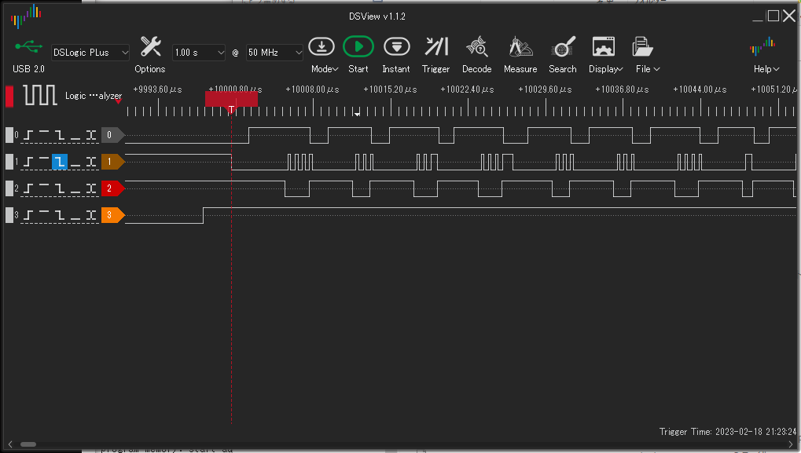
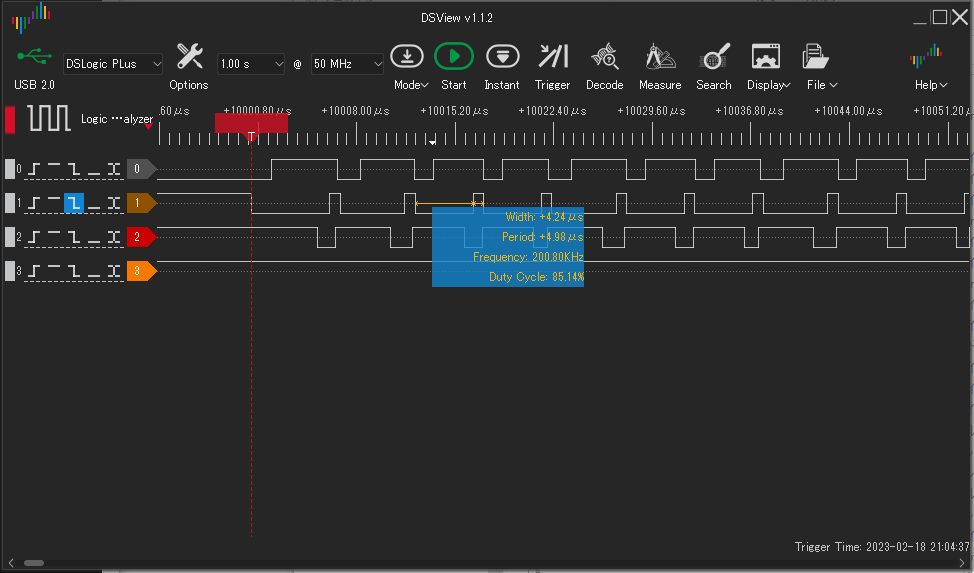
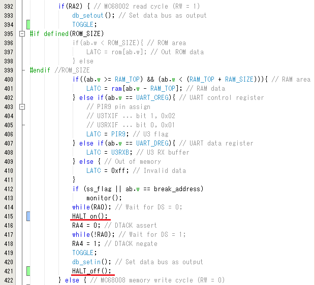
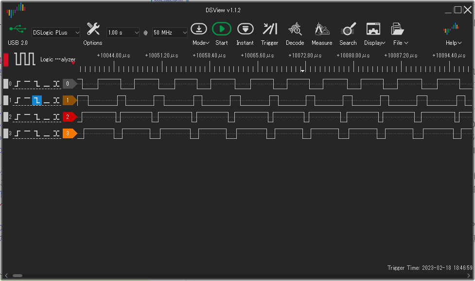
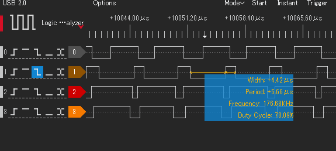

# EMU68k改: 命令飛びの回避

## 概要

* EMU68k改の68008駆動処理では、68000クロックを上げると命令飛びが発生する。
* このとき、DTACKをHに戻すタイミングが遅く、次のマシンサイクルが停止せず(PICが関与しないまま進み)、結果としてごみを読み込む/書き込みが無視された状態で68008の実行が進んでしまっている。
* 命令飛びを回避するにはいくつかの方法が考えられるが、今回はDTACKをLにする直前にHOLD=Lとしておき、DSがHに戻ってからHOLDをHに戻す。これにより次のメモリアクセスも確実に捕まえることができる。

## 命令飛びの発生

68008クロック6MHzのとき、シングルステップ実行で、0,1番地の次に5番地までアクセスが飛んだ。シングルステップでアドレスが連番になっていないことは、PICがRAMデータを渡せていないことを示している。

信号幅を見て命令飛びが発生しているかどうかを見た。



上図はクロック6MHz, #0はTEST, #1はDS, #2はDTACK, #3はHOLD端子です。

長いDS==Lの後に短いDS==Lのサイクルが3サイクル続いている。DS==L 1つにつきメモリアクセス(Read)を1回行っている。短いサイクルは、PICがデータバスにRAMデータを載せずに過ぎている。謎データを読み込んでCPUの処理はどこへ行ったのやら。

```
   while (RA0);
```
でDS==Hを待っているが、この時間粒度だと、1回読み込んでから次の読み込みまでの間が数100nsとなってしまうのだろう、RA0 == H を見逃していると考えられる。

68008クロック 2MHzで同じ波形を見てみる。このとき安定動作している。



こちらは#1 DSのL->Hエッジを逃さず680ns後に#2 DTACK == Hに戻しており、次のサイクルを逃さず止めている。1サイクルが4.5us～4.75usで回っている。

## 命令飛びの回避

PICの処理終了後、DTACKをLにしてから確実に(次のマシンサイクルが始まる前に)Hにすればよい。

### 1. ハードウェアでDTACKをHにする。  
* CLCを使い、DSの上りエッジを検出してDTACKをリセットすればよい。これで68008は確実に次のマシンサイクルもDTACK==Hで開始し、PICがデータバスを処理できるようになる。  
* 但し、リードサイクルの次にライトサイクルが来るとき、リードサイクの終わりでPORTCを入力モードに切り替える(TRISC=0xff)必要がある。68000が次のサイクルの途中で止まるが、その時点で68008はデータバスにデータを出力している。PIC側がTRISC=0xffを十分速く実行しないとバスバッファで出力の衝突が発生する。これは68008,PIC双方にとって良くない。
* データバスの出力を短時間で切り替えるには、外部に3ステートラッチを付けてコントロールすることになるが、それでは2チップ構成のこだわりを貫くことはできない。却下である。
### 2. HOLDを使い次のサイクルへの突入を遅らせる。
* メモリアクセス処理の終わりの、DTACKをLにする前にHOLDをLにする。PICがDS==Hを検知してから(PORTCをINモードにし、DTACKをHにしてから)HOLDをHに戻す。これで次のサイクルも確実にPICが拾えるようになる。
* 私はこの手を[Z80-MBC(2016)](https://hackaday.io/project/19000)から学んだ。Z80でもWAITの戻しで同様な問題が起こるので、BUSRQ信号を落として対応していた。

と考えて、HOLD信号の処理を追加した。



68008 CLK 6MHzの信号波形である。DS, DTACK, HOLDにTESTピン信号の4本が表示されている。



0灰: TEST  
1茶: DS  
2赤: DTACK  
3橙: HOLD  

DSがLになる前にDTACKがHになり、DSがLになる(次のサイクルが開始する)前にDTACKがHになっている。毎サイクル確実にPICが捉えていることがわかる。

> 参考までに、TEST==Hの長さがPIC内部処理の時間(AS==Lを検知してからHOLDをHにするまで)である。

うちの68008はmax 10MHzなので、CLK 10MHzまで進めたが問題なく動作している。

参考までに各クロックでのDS信号の周期(メモリサイクル周期に相当する)を記すと

|CLK周波数(MHz)|DS周期(us)|
|--|--|
|2MHz|6.98us|
|6MHz|5.66us|
|10MHz|5.38us|
|||

<br>
図2: DSの周期(CLK 6MHz)

68008のクロック周波数を上げた割合に処理速度の向上はついていかないことが分かる。

単純に計算して、ノーウェイト(PIC内部の処理がゼロ時間とした場合)の実行時間は4クロック分で、10MHzで0.4us, 2MHzで2usに相当する。これと上記の時間を比較すると、PIC内部の処理時間は約5usであり、これを短くしないと大幅な速度向上は望めない。

PIC内部の処理は、C言語的に見て削りようがなさそうで、PICアセンブラに書き換えて向上を狙うぐらいしか思いつかない。奥江さんのコードは主要部分をアセンブラ化していたように見えた。あのあたりが限界だと思う。

で、振り返ってみると、最初の測定で得たDSサイクルが4.5～4.75usと、HALT版よりも短い。現時点ではHALT対応はあまり意味がなさそう。

3チップ/RAM化するときには、68000 CLKの速度がそのままパフォーマンスに反映されるだろう。その時にはHALT対応の意味が出てくる。今回はムーアの旅路をたどることが主目的なので、ここにはこれ以上立ち入らないことにする。

