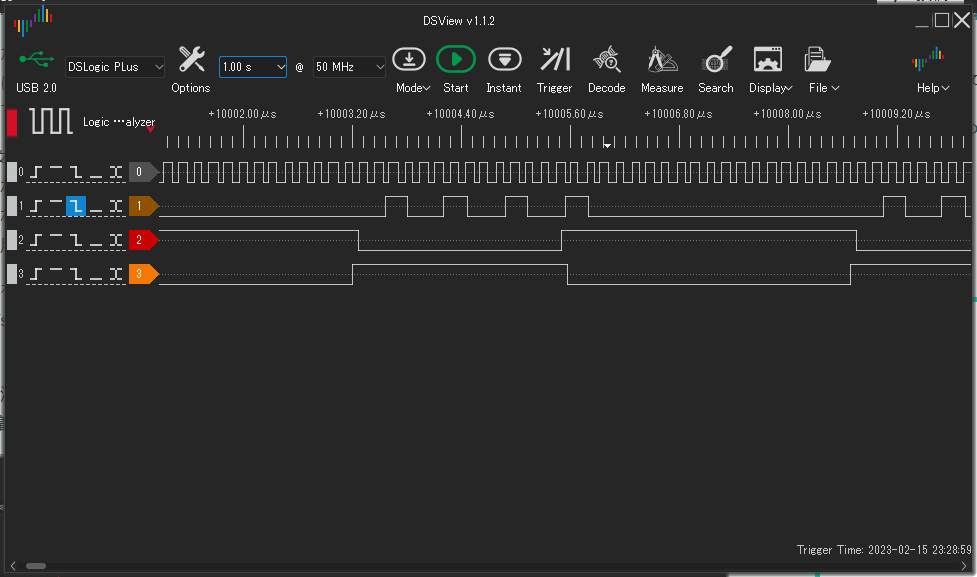
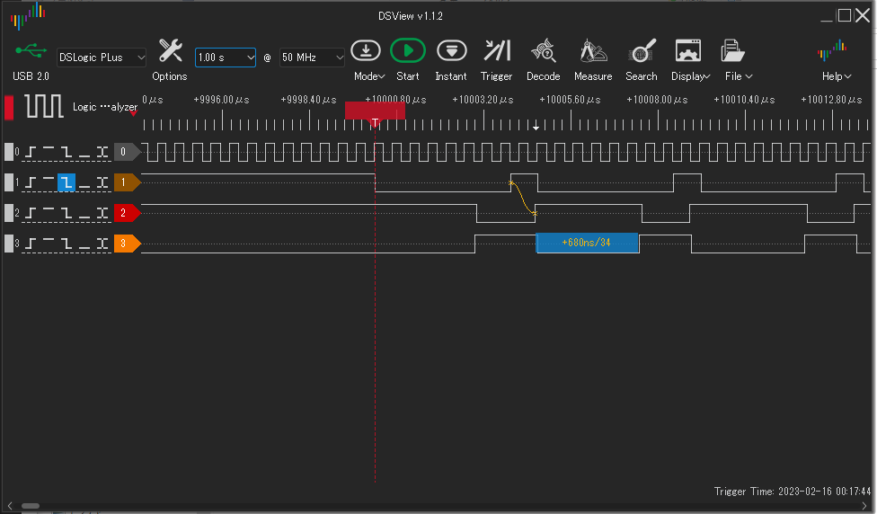

# EMU68k改: クロック周波数とDTACKマージン

68008クロック6MHzのとき、シングルステップ実行で、0,1番地の次に5番地までアクセスが飛んだ。信号幅を見てスリップが発生しているかどうかを見た。



上図はクロック6MHz, #1はDS, #2はDTACK, #3はTEST端子、DTACKをLにする直前にHにして、DTACKをLにする直後にLにしている。

長いDS==Lの後に短いDS==Lのサイクルが3サイクル続いている。DS==L 1つにつきメモリアクセス(Read)を1回行っている。短いサイクルは、PICがデータバスにRAMデータを載せずに過ぎている。謎データを読み込んでCPUの処理はどこへ行ったのやら。

```
   while (RA0);
```
で待っているが、この時間粒度だと、1回読み込んでから次の読み込みまでの間が数100nsとなってしまうのだろう、RA0 == H を見逃していると考えられる。

68008クロック 2MHzで同じ波形を見てみる。このとき安定動作している。



こちらは#1 DSのL->Hエッジを逃さず680ns後に#2 DTACK == Hに戻しており、次のサイクルを逃さず止めている。1サイクルが4.5us～4.75usで回っている。

PIC18F47Q43でソフトポーリングには限界がある。
