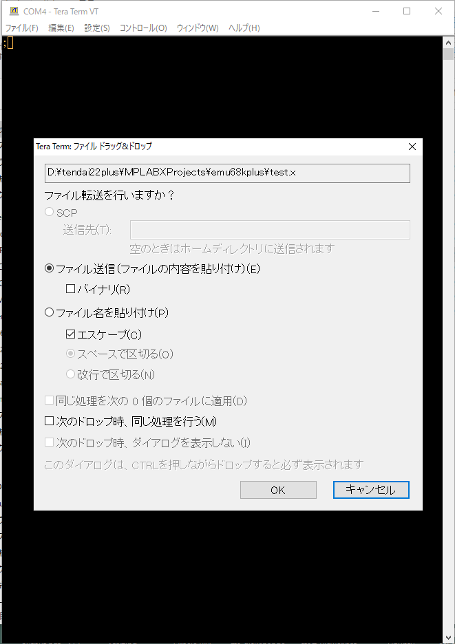
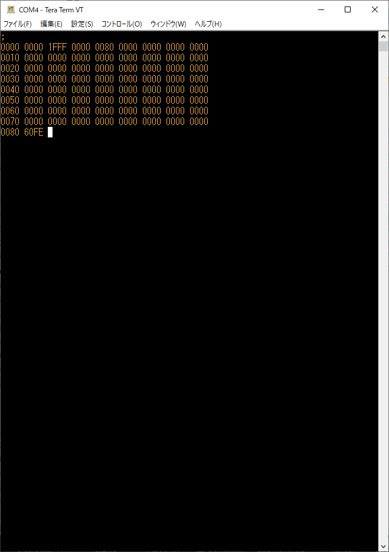

## 開発環境と使い方

1960年代後半の開発環境は、ハンドアセンブルで機械語のバイト列を書き出し、パネルスイッチで１バイトずつ書き込んでから実行するというものだったと推察します。さすがにハンドアセンブルは苦しいので、68000のアセンブラは使わせてもらうことにしました。
1. アセンブリ言語でソースコードを書く。
2. アセンブラでバイナリを生成する。
3. 16進ダンプコマンドで、バイナリから16進ダンプリストを出力する。
4. ダンプリストにアップロード用コマンドを挿入して、アップロード用テキストを作成する。
5. Teratermにアップロード用テキストをドラッグアンドドロップしてRAM上にバイナリを載せる。
6. 実行開始のためのコマンド('.'3連打)を入力し実行を開始する。

## アセンブラ

WSL使いなので、Linux上で動くアセンブラを使います。GNU Assemblerを68000用にビルドして使うのが王道っぽい。

ビルド方法は[GCC_INSTALL.md](GCC_INSTALL.md)を参照ください。https://github.com/ddraig68k/m68k-elf-toolchain をcloneしてから作業を開始しますが、準備と手直しがいくつか必要です。

> Windowsユーザには[Easy68k](http://www.easy68k.com/)が使えそうです。

GCCのインストールが完了すると、`/opt/m68k-elf/bin/` の下にツールがそろいます。ここにパスを通しておきます。

アセンブラコマンドは `m68k-elf-as` です。ソースコード `test.s` を用意すると、
```
$ m68k-elf-as -o test.o test.s
```
でオブジェクトファイル`test.o`が生成できます。

## アセンブラの構文

m68k-elf-asは、Sun Assembler準拠の構文を採用しており、以下のように「皆が知っている68000アセンブラ」と異なる。

> gun-assembler.pdf に記載がある。

||Motorola|Sun Assember|
|--|--|--|
|コメント|`; ...`|`/* ... */`|
|文字定数|`"a"`|`'a'`
|16進数|`$1F5E`|`0x1F5E`
|レジスタ|`a7`<br>`d0`|`%a7`<br>`%d0`
|EQU|`start equ $80`|`.set start, 0x80`
|ORG|`org start`|`.org start`
||||

> ポストインクリメントは `(a7)+` -> `%a7@+` が正式だそうだが、(%a7)+ も受け入れてくれるらしい。

### 見慣れた書式
```
; definitions
ram         equ 0
start       equ $80

    org     ram
    dc.l    $1fff
    dc.l    main
    org     start
main:
    bra.b  main
```
### Sun Assembler形式
```
/*  definitions */
 .equ ram,  0
 .equ start,  0x80

 .org      ram
    dc.l    0x1fff
    dc.l    main
 .org      start
main:
    bra.b  main
```
リポジトリには Sun Assembler書式に変換するツール`conv.sh`を入れておいた。シェルスクリプトなので`sh`コマンドの第1引数で指定すればよい。
```
$ sh conv.sh test.s > test-sun.s
```
## バイナリ

`test.o`から16進ダンプを得るには、objdumpコマンド(`m68k-elf-objdump`)を使います。
```
$ m68k-elf-objdump -D test.o

test.o:     file format elf32-m68k


Disassembly of section .text:

00000000 <main-0x80>:
   0:   0000 1fff       orib #-1,%d0
   4:   0000 0000       orib #0,%d0
        ...

00000080 <main>:
  80:   60fe            bras 80 <main>
```
## アップロードファイル
バイナリダンプをアップロードできるようにしました。

リポジトリをビルドしてファームを焼き込めば使えます。

* `=`の後ろに16進数を並べると書き込むアドレスをその数に切り替える。
" 16進数を1つ書くと、16ビット(2バイト)に展開して書き込み、アドレスを2増やす。
* `!`を1文字書くとそれまで書き込んだデータをダンプする。
* アドレス指定、16進数データ、`!`コマンドそれぞれの間はスペース又は改行文字で区切る。

例えば、先ほどアセンブルした`test.o`をアップロードするには、
```
=0 0000 1FFF 0000 0080
=80 60fe !
```
というファイルを作って、TeraTermにドラッグアンドドロップすればよい。
## アップロード

電源SWをONしてリセットボタンを押すと、プロンプトとして`;`文字1文字が表示される。このとき、CPUはリセット状態でアップロードファイル待ちになっている。

先ほど作ったファイル、(例えば)`test.x`をTeraTermのウインドウにドラッグアンドドロップすると、



のダイアログが出てくるので、OKを押す。すると



と、アップロードしたデータが表示されるので、ざっと見て確認してから、'.'を3回叩くと、リセットが解除され68008の実行が開始される。

アップロードコマンドは、ファイル形式にしてアップロードしなくても、手で打ち込んでも有効です。

## 実行開始

アップロードコマンド待ちの状態で、'.'を3回連打すると実行が開始される。リセットが解除され68008の実行が開始される。

現在のファームでは、20バイトフェッチ(or write)したところで実行が停止される。以後、スペースバーを叩くごとに1フェッチ・シングルステップが進む。


