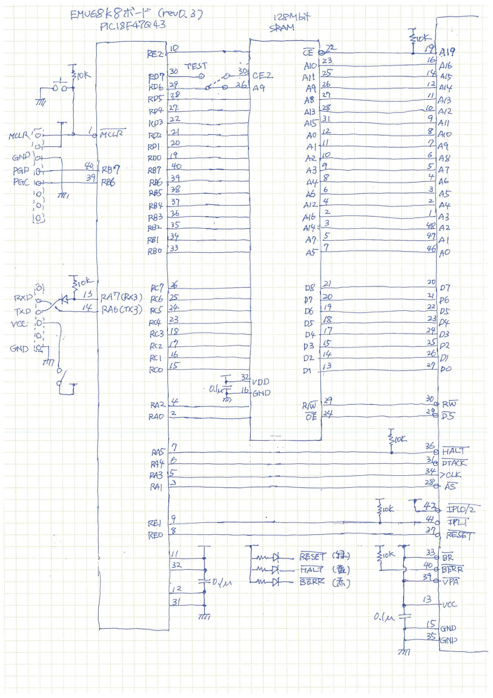

# EMU68k改

電脳伝説さんの[EMU68k8](https://vintagechips.wordpress.com/2022/10/23/emu68k8_results/)をベースにRAM容量を128kB(64kワード)に増強したシングルボードコンピュータです。ハードウェアとしては、68008とPIC18F47Q43に加え、1Mbit(128kB)SRAMも付けた3チップ構成です。コンセプトは@Just4Funさんの[68k-MBC](https://hackaday.io/project/177988-68k-mbc-a-3-ics-68008-homebrew-computer)に近いです。

現在のところ、SRAMは未サポートです。2チップ構成で動きます。

今回の試行のねらいは、いつものように、新しいCPUを動かして楽しむ、ではなく、FORTHを作り上げたチャールズムーアの足跡をたどる、です。50年前のコンピュータを模した環境を手元に用意して、限られたCPU/RAMしかない新しいコンピュータに自分の開発環境を作り上げていった彼と同じことを行い、今とは違う当時の環境で生き延びた彼の気持ちを味わってみようというわけです。

具体的には、68k8基板上にFORTH処理系を段階的に作り上げてゆきます。既にあるFORTH処理系を「移植」するのではなく、機械語をスイッチで1バイトずつ手で書き込むところから始めてFORTH処理系を一通り動かすところまでやってみる、です。

以下、いくつかのテーマでMarkdownファイルを用意しました。

* [なぜにFORTH? なぜにチャールズムーア?](WHYFORTH.md)  
  私がFORTHにハマったわけと、FORTHの特徴と、今回のプロジェクトを始めるに至った考えを記しています。

* [開発環境と使い方](FIRMWARE.md)  
  ボードを作った後、どうやって使うかを説明しています。

## システムのイメージ

ということで、今回のSBCを使って実現したいシステムは以下のとおりです。

* 68008 + RAM + Teraterm/minicom (端末の代用)
* スイッチパチパチ＋紙テープリーダパンチャの再現
* PCからTeraTerm/minicomでシリアル接続、手で打ち込む。
* 紙テープリーダ、ライター: ホスト側ダンプファイルをボード上RAMに書き込み、とボード上RAMの内容をホストファイルにダウンロード。TeraTermマクロで作成、マクロ実行(メニューから実行、Drag&Dropはできない様子)

|1970年|現代|
|--|--|
|データを手で1バイトずつ打ち込む。<br>アドレススイッチをぱちぱちしてデータを1バイトずつ打ち込んでゆく。|簡易モニタのコマンドで1ワードずつRAMに書き込む
|RAMのデータを見る。アドレススイッチをパチパチしてデータ16bitをLEDで見る。|簡易モニタのダンプコマンドで見る
|シングルステップ実行。1命令ずつ実行・停止する。|1サイクル実行して止まる。スペースバーを叩くとさらに1サイクル実行する。|
|紙テープからRAMにロード|Teratermのテキストアップロード機能で、RAMイメージをアップロードする。
|紙テープに書き出す|(未作成、当分、マスターファイルは手元にあり、実機でコードを修正した結果は手元のマスターファイルに手動で反映させる)

当時は、アセンブラも簡単には使えなかったと思います。基本はハンドアセンブルだったのではないかと考えています。私はズルさせてもらい、PC側でアセンブラで機械語を作らせてもらうことにします。68000の機械語はまったく分かっていないので。

## ボードの設計

RAMは16kワード欲しいので、SRAMチップも加え3チップで構成する。
ただし、最初は試作用として2チップで開始する。128kByte SRAM使うのは手元にあるもので間に合わせているから。数個あるんですよ。


* 128kRAM: A0-A17(3チップ構成)  
  6kBRAM: A0-A12(2チップ構成)
* PIC: A0-A13 + A19(CE/) + CE2
* 電源はUSBシリアルから取る。
* クロックはPICから提供。

||3チップ構成|2チップ構成|
|--|--|--|
|RAM容量|128kB|6kB|
|アドレスバス|A0-A17|A0-A12|
|空間|00000-3FFFF|00000-017FF|
|実体|128kRAM|PIC内蔵RAM|

## PIC機能

* CPUコントローラ: 仮想I/Oデバイス(シリアルI/O)、メモリローダ、
* 仮想I/Oデバイス: A19==1でI/O空間、A19==0でRAM有効
* シリアルI/O: A19==1のどこかのアドレス($80000, $80001)に仮想UARTのステータスレジスタとデータレジスタを置く(==PICのUARTレジスタをそのまま返す)
* メモリローダ: PIC RESET直後にコマンド入力待ちで止まる。テキスト形式のコマンドを入力すると、書き込み先アドレスとデータを指定する。  
  * 2チップ構成の場合、PIC内蔵RAMにデータを格納してゆく。
  * 3チップ構成の場合、68008自身をだまして書き込み命令を実行させてRAMに書き込む。
* シングルステップ: DTACKを返さずにメモリアクセス待ちで止める。Teraterm画面に実行中の命令をダンプする。
* バス乗っ取り: CE2==0にするとSRAM自身をdisableにできる。この状態でRESET解除してCPUのメモリアクセスをすべて押さえる。
* 簡易モニタ: テキスト形式コマンドを受け付ける。アドレス指定(`=`の後ろに16進数)、データ指定(16進数)、メモリダンプ(視認)、リセット開始とシングルステップ実行。

## 回路図

回路図は3チップ構成で作ってある。現在はSRAMはソケットのみで実チップ搭載していない。



## 回路図：電脳伝説版からの改変内容

* ピン割り当ての変更(以下で説明)アドレスバス・割り込みピンの割り当て変更(上記で説明)  
* DCジャックを節約し、USBシリアルから5Vを直接取る。
* 10uFコンデンサを、電源SWの外側に移動させた。  
  当初内側に付けたが、その場合、電源ON時の突入電流が大きくUSBシリアルが一瞬切れる(PC側のUSB接続が一時的に解除される)。多少ましになったような気がする。
* BERRのHi固定を止めてプルアップにする(LEDを繋いで点灯できるようにするため)  
  バスエラーはソフト要因で起こる可能性があるので、LED
* HALTにプルアップ抵抗を付ける。

## ピン割り当て

* 割り込みが必要なので1ピンは残す。2ピン不要なので1ピンを別に回す。
* I/O空間との分離を外部回路なしでやるために、A19の値で切り分ける。
* TESTピンを一つ割り当てる。
* SRAMのCE1本分も必要。命令置きによるブートローディングに必要。
* SDCard/SPIのためには、SCLKだけは専用割り当てが必要。MOSIが68008とぶつからないようにするためにはさらに1本専用割り当てが必要か?
* 3チップ構成・命令置きによるブートローディングに割り込みアクノレッジサイクルの識別のために、ある程度のアドレスバス線を見たい。

|ピン名|割り当て<br>(2チップ構成)|割り当て<br>(3チップ構成)|備考
|--|--|--|--|
|RE0|RESET/|RESET/|
|RE1|IPL1/|IPL1/|
|RE2|A19|A19|(MEM/IOとして扱う)|
|RD7|TEST|TEST|
|RD6|A14|CE2|(ジャンパ切替え)|
|RD5|A13 |SCLK|(SDカード搭載時にSCLKに切替え)|

## メモリマップ

* PIC内蔵メモリと外部SRAMの区分を明確化
* PIC接続のアドレスバス線は13本(A0-A12)を想定

### 内蔵版 6kB

|開始|終了|size|実体|説明|
|--|--|--|--|--|
|00000|003FF|1kB|ソフト生成|ベクタ|
|00400|01BFF|6kB|内蔵RAM|コード/データ|
|80000|80FFF|*|I/Oポート|

### SRAM版 128kB

|開始|終了|size|実体|説明|
|--|--|--|--|--|
|00000|003FF|1kB|外部RAM|ベクタ|
|00400|013FF|4kB|外部RAM|コード/データ|
|01400|1FFFF|124kB|外部SRAM|コード/データ|
|80000|803FF|1kB|ディスクバッファ（PIC内部)|
|80400|...|1b|シリアルI/O(データレジスタ(R/W))|
|80401|...|1b|シリアルI/O(コマンド(W)/ステータス(R))|
|80402|...|1b|ページ番号(H)|
|80403|...|1b|ページ番号(L)|
|80404|...|1b|コマンドワード(W)/ステータス(R)|

## PIC用ファームウェア

ファームウェア起動後、PICのGPIO初期設定を行い、シリアルポートUART3を初期化し、
RESET,HALTをLにしてキー入力を待つ。

この状態でデータ書き込みコマンドが使える。それを含むテキストファイルをTeraTermからアップロードすることで、PC側で開発した68008機械語をRAMに書き込む。

RAM書き込みが終わると、実行開始コマンド(`.`を3回連打)を叩くと68008のプログラム実行が開始される。

## シングルステップ

DTACKをアサートしない限り、アドレスバスとデータバスに有効データを出したままメモリアクセスは継続する。よって、各サイクルごとにアドレスバス、データバスの値を読み込んでダンプすればシングルステップは可能である。

今のところ、20サイクル実行後シングルステップで止まるようにしている。

サイクル途中で停止すると、
* アドレスバスの値(A0-A13)
* データバスの値
* R/Wピンの値
* RESET,HOLDピンの値(シングルステップ時は常時Lですが)

が表示される。

## リセット前のアップロード

RAMに書き込むデータを指定することができる。手で打ち込んでも良いが、ファイルを用意してアップロードしても良い。

|書式|説明|
|--|--|
|=[hexstr]|アドレスカウンタに値をセット
|[hexstr]|メモリ書込み。指定した16進数2バイトをRAMに書き込む。<br>書き込み後アドレスカウンタがインクリメントされる。
!|メモリダンプ、それまでに書き込んだ領域を16進ダンプする。
|...|アップロードモードを抜けて、68008実行開始
|||

メモリダンプのダンプ範囲は、アドレスカウンタ最小の値と最大の値の間である。
セットコマンドの例は以下の通り。
```
=0 0000 1FFF 0000 0080
=80 60fe !
```
