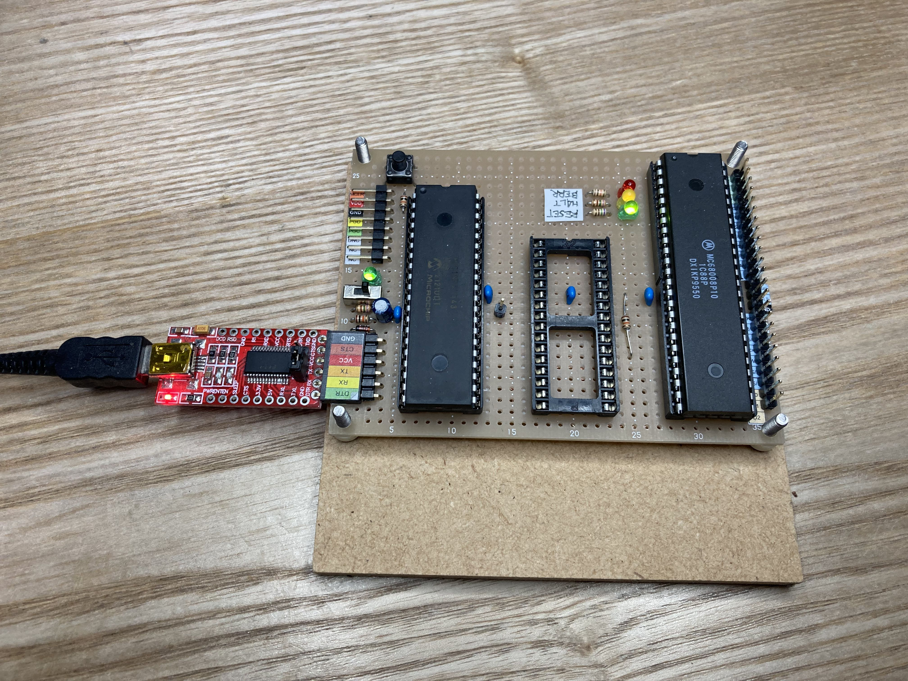
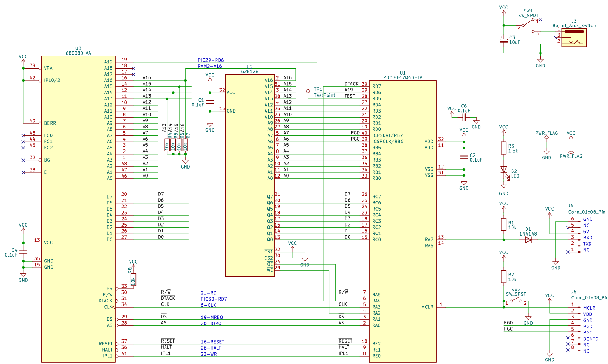

# EMU68k改(Rev.003 SRAM 3chip版)

電脳伝説さんの[EMU68k8](https://vintagechips.wordpress.com/2022/10/23/emu68k8_results/)をベースにRAM容量を128kBに増強したシングルボードコンピュータです。ハードウェアは、68008とPIC18F47Q43に加え、1Mbit(128kB)SRAMを付けた3チップ構成です。コンセプトは@Just4Funさんの[68k-MBC](https://hackaday.io/project/177988-68k-mbc-a-3-ics-68008-homebrew-computer)に近いです。SRAM の制御はPICから/OE, /WEを制御する[奥江さんの方式](https://github.com/satoshiokue/SuperMEZ80)を採用しています。

ファームウェアにSRAM対応を入れ、3チップ構成で動きます。

> 2023-3-9: 3チップ版が動作しだしたので、本稿を改版しています。

今回の試行のねらいは、**FORTHを作り上げたチャールズムーアの足跡をたどる**、です。50年前のコンピュータを模した環境を手元に用意して、限られたCPU/RAMしかない新しいコンピュータに自分の開発環境を作り上げていった彼と同じことを行い、今とは違う当時の環境で生き延びた彼の気持ちを味わってみようというわけです。

具体的には、EMU68k8(改)基板上にFORTH処理系を段階的に作り上げてゆきます。既にあるFORTH処理系を「移植」するのではなく、**機械語でputchを書くところから始めて、少しずつ機能を足してFORTH処理系を一通り動かすところまでやってみる**、です。

以下、本ファイルでは、EMU68k改の基板とファームウェアを説明します。基板とは直接関係しないが、本プロジェクトにとって重要なテーマについて、追加の説明を用意しました。

* [なぜにFORTH? なぜにチャールズムーア?](WHYFORTH.md)  
  私がFORTHにハマったわけと、FORTHの特徴と、今回のプロジェクトを始めるに至った考えを記しています。

* [開発環境と使い方](FIRMWARE.md)  
  ボードを作った後、どうやって使うかを説明しています。



## システムのイメージ

今回のSBCを使って実現したいシステムは以下のとおりです。

* 68008 + RAM + Teraterm/minicom (端末の代用)
* スイッチパチパチ＋紙テープリーダパンチャの再現
* PCからTeraTerm/minicomでシリアル接続、手で打ち込む。
* 紙テープリーダ、ライター: ホスト側ダンプファイルをボード上RAMに書き込み、とボード上RAMの内容をホストファイルにダウンロード。TeraTermマクロで作成、マクロ実行(メニューから実行、Drag&Dropはできない様子)

この背景にある1970年の開発環境と、それに対応する今回の環境の対比は以下の表になります。

|1970年|現代|
|--|--|
|データを手で1バイトずつ打ち込む。<br>アドレススイッチをぱちぱちしてデータを1バイトずつ打ち込んでゆく。|簡易モニタのコマンドで1ワードずつRAMに書き込む
|RAMのデータを見る。アドレススイッチをパチパチしてデータ16bitをLEDで見る。|簡易モニタのダンプコマンドで見る
|シングルステップ実行。1命令ずつ実行・停止する。|1サイクル実行して止まる。スペースバーを叩くとさらに1サイクル実行する。|
|紙テープからRAMにロード|Teratermのテキストアップロード機能で、RAMイメージをアップロードする。
|紙テープに書き出す|(未作成、当分、マスターファイルは手元にあり、実機でコードを修正した結果は手元のマスターファイルに手動で反映させる)

当時は、アセンブラも簡単には使えなかったと思います。基本はハンドアセンブルだったのではないかと考えています。私はズルさせてもらい、PC側でアセンブラで機械語を作らせてもらうことにします。68000の機械語はまったく分かっていないので。

## ボードの設計

RAMは16kワード欲しいので、SRAMチップも加え3チップで構成します。128kByte SRAM使うのは手元にあるものを有効活用したいから。ストックが数個あるんですよ。

* 128kRAM: A0-A17 
* PIC: A0-A12 + A19
* 電源はUSBシリアルから取る。
* クロックはPICから提供。

## PIC機能

* CPUコントローラ: 仮想I/Oデバイス(シリアルI/O)、メモリローダ、
* 仮想I/Oデバイス: A19\==1でI/O空間、A19\==0でRAM有効
* I/Oデバイス: ASの下りエッジでA19\==1のとき、I/O空間へのアクセスとみなし、PICがメモリアクセスを受ける。このとき/DTACK\==Hとしてあるので、PIC内部では好きなだけ時間をかけて処理を行うことができる。PORTCのR/Wを行い、終了後サイクルを完了しCPUの実行を再開させる。
* シリアルI/O: A19==1のアドレス(\$800A0, \$800A1)に仮想UARTのステータスレジスタとデータレジスタを置く(==PICのUARTレジスタをそのまま返す)
* メモリローダ: PIC RESET直後にコマンド入力待ちで止まる。テキスト形式のコマンドにより、書き込み先アドレスとデータを指定する。  
* 今回の版では、PICから直接アドレス指定可能な範囲のSRAMに直接書き込んでいる。
* 招待的には、68008自身をだまして書き込み命令を実行させてRAMに書き込む「命令置き」に変更する予定です。
* シングルステップ: DTACKを返さずにメモリアクセス待ちで止める。Teraterm画面に実行中の命令をダンプする。
* バス乗っ取り: SRAMアクセス制御は、PICに接続された/WE,/OEで行う。通常はCLC1,2がアドレスデコード(A19\==L && /DS\==L && R/W ==H or L)の出力/WE, /OEに出力するようにしている。命令置きの際には、この2ピンをソフト制御し、データバスに自分の都合に合わせてデータを置く。
* ミニローダ: アドレス指定とデータ指定だけの簡単なローダ。シリアルポートからファイルイメージをアップロードする形で運用する。

## 回路図

3チップ構成の回路図です。



## 回路図：電脳伝説版からの改変内容

* ピン割り当ての変更(以下で説明)  
* DCジャックを節約し、USBシリアルから5Vを直接取る。
* 10uFコンデンサを、電源SWの外側に移動させた。  
  当初内側に付けたが、その場合、電源ON時の突入電流が大きくUSBシリアルが一瞬切れる(PC側のUSB接続が一時的に解除される)。多少ましになったような気がする。
* BERRのHi固定を止めてプルアップにする(LEDを繋いで点灯できるようにするため)  
  バスエラーはソフト要因で起こる可能性があるので、LEDをつけて確認できるようにしておく。現在のところ、ソフト要因でバスエラーを起こし切れていない。
* HALTにプルアップ抵抗を付ける(回路図では漏れている)。

## ピン割り当て

* 割り込みは2ピン不要、但し1つは必要なので1ピンを別に回す。
* I/O空間との分離を外部回路なしでやるために、A19の値で切り分ける。
* TESTピンを一つ割り当てる。ロジアナを繋いでソフト処理の進み具合を見るため。
* SRAMの/WE,/OEをPICにつなぎ、68k8の直接の信号はかからない。PICのCLCでアドレスデコード結果を渡すので、高速のメモリアクセスが実現できる。命令置きによるブートローディングに必要。
* SDCard/SPI: 命令置きでブートローディングできるようになれば、アドレスピンをPICにつなぐ必要性が薄れる(最低0本は必要だが)。RD4-RD1の１本を割り当てて、PICにつながるアドレスバスはA0-A8までの512バイトとなる。
* SDcard用SPIピンの共有はMISOも衝突が起きているという報告があり、SCLK, MISOの２本は専用化が必要だろう。ここまでくると面倒なので4本とも専用割り当てとする。
* 3チップ構成・命令置きによるブートローディングに割り込みアクノレッジサイクルの識別のために、ある程度のアドレスバス線を見たい。
* CLCを使う都合上、その他のピンも大幅に割り当て変更してある。

|ピン名|割り当て<br>(3チップ構成)|備考
|--|--|--|
|RD7|/DTACK|CLC3(D-FF)の出力、I/Oアクセス時には/DTACKを立て、PIC内部処理に任せる。
|RD6|A19|メモリ/IO空間の分離|
|RD5|TEST|ロジアナをつなぎソフト内のポイントとの対応関係を見る|
|RA5|R/W|
|RA4|SRAM /OE|CLC1(4 in AND)の出力
|RA3|CLK|(電脳伝説版のクロック設定をそのまま使用している)
|RA2|SRAM /WE|CLC2(4 in AND)の出力
|RA1|/DS|
|RA0|/AS|
|RE2|/RESET|
|RE1|/HALT|
|RE0|IPL1|

## メモリマップ

* 基板Rev. 003を想定しています。
* PIC接続のアドレスバス線は13本(A0-A12)を想定します。
* SDcard I/F搭載時は、アドレスピンがさらに減ります。

### SRAM版 128kB

|開始|終了|size|実体|説明|
|--|--|--:|--|--|
|00000|003FF|3kB|SRAM|ベクタ|
|00400|1FFFF|125kB|SRAM|コード/データ|
|800A0|...|1b|PIC|シリアルI/O(コマンド(W)/ステータス(R))|
|800A1|...|1b|PIC|シリアルI/O(データ)|
|800A2|...|1b|PIC|HALTレジスタ、このアドレスへのアクセスでCPUは停止する|
|80100|801FF|256b|PIC|DBG TABLE、この領域へのアクセスでCPUは停止し、キー入力をまって再開する|

## PIC用ファームウェア

ファームウェア起動後、PICのGPIO初期設定を行い、シリアルポートUART3を初期化し、
RESET,HALTをLにしてから、クロックの供給を開始し、キー入力を待つ。

この状態でデータ書き込みコマンドが使える。それを含むテキストファイルをTeraTermからアップロードすることで、PC側で開発した68008機械語をRAMに書き込む。

RAM書き込みが終わると、実行開始コマンド(`.`を3回連打)を叩くと68008のプログラム実行が開始される。

## シングルステップ

パネルスイッチパチパチ環境にシングルステップは必須です。

DTACKをアサートしない限り、アドレスバスとデータバスに有効データを出したままメモリアクセスは継続します。よって、各サイクルごとにアドレスバス、データバスの値を読み込んでダンプすればシングルステップは可能です。

サイクル途中で停止すると、
* アドレスバスの値(A0-A13)
* データバスの値
* R/Wピンの値
* RESET,HOLDピンの値(シングルステップ時は常時Lですが)

が表示される。

## 68k8スタート前のアップロード

RAMに書き込むデータを指定することができる。手で打ち込んでも良いが、ファイルを用意してアップロードしても良い。

|書式|説明|
|--|--|
|=[hexstr]|アドレスカウンタに値をセット
|[hexstr]|メモリ書込み。指定した16進数2バイトをRAMに書き込む。<br>書き込み後アドレスカウンタがインクリメントされる。
!|メモリダンプ、それまでに書き込んだ領域を16進ダンプする。
|...|アップロードモードを抜けて、68008実行開始
|||

エコーバックは一切行わない。エコーバックを控えることでPICが受信処理・内部処理に注力できて、シリアル伝送速度を上げることができる。

メモリダンプのダンプ範囲は、アドレスカウンタ最小の値と最大の値の間である。
セットコマンドの例は以下の通り。
```
=0 0000 1FFF 0000 0080
=80 60fe !
```

## CPUクロックを上げる。

SRAM版になり、SRAMノーウェイトアクセスができるようになった。手持ちのチップのクロック上限である10MHzでも命令実行はできている様子である。シリアルI/Oで取りこぼしが発生するようなので、現在は8MHzまで下げている。

## シリアルクロックを上げる

オリジナルは9600bpsだが、115200bpsとなるようにシリアルクロックを変更している。

メモリアップロード機能の実装の際には処理に時間がかかりすぎて取りこぼしがないように配慮している。具体的には、コマンド読込・RAM書き込み中はエコーバックしない。処理に時間が掛かる要因は、コマンド文字列のエコーバックが大きい。よってエコーバックを抑制することで内部処理時間を大幅に下げることができる。

