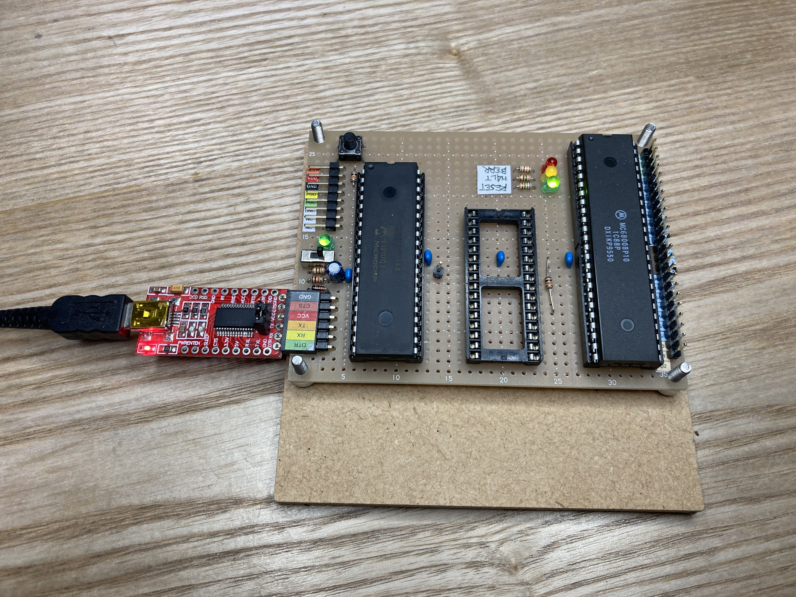
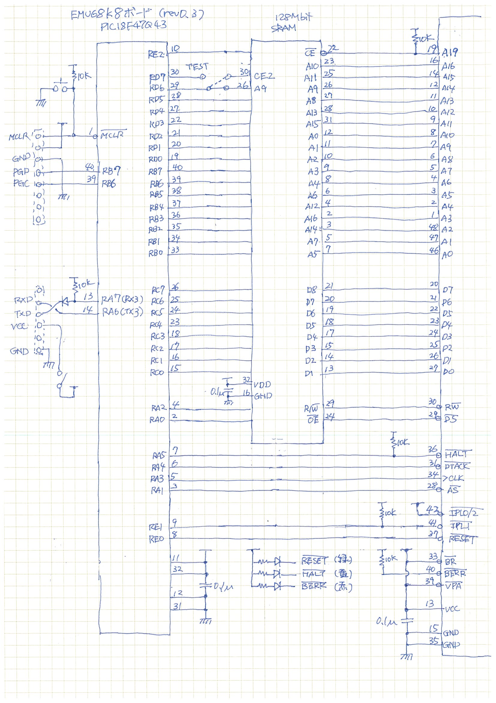
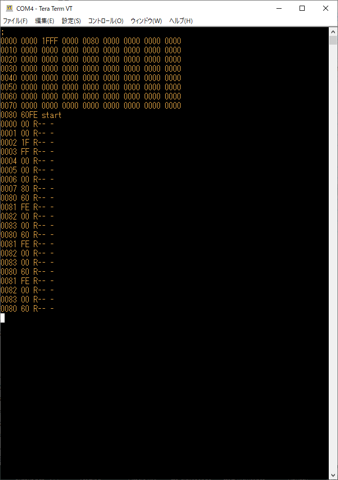

# EMU68k改

電脳伝説さんの[EMU68k8](https://vintagechips.wordpress.com/2022/10/23/emu68k8_results/)をベースにRAM容量を128kB(64kワード)に増強したシングルボードコンピュータです。ハードウェアとしては、68008とPIC18F47Q43に加え、1Mbit(128kB)SRAMも付けた3チップ構成です。コンセプトは@Just4Funさんの[68k-MBC](https://hackaday.io/project/177988-68k-mbc-a-3-ics-68008-homebrew-computer)に近いです。

現在のところ、SRAMは未サポートです。2チップ構成で動きます。

今回の試行のねらいは、**FORTHを作り上げたチャールズムーアの足跡をたどる**、です。50年前のコンピュータを模した環境を手元に用意して、限られたCPU/RAMしかない新しいコンピュータに自分の開発環境を作り上げていった彼と同じことを行い、今とは違う当時の環境で生き延びた彼の気持ちを味わってみようというわけです。

具体的には、EMU68k8(改)基板上にFORTH処理系を段階的に作り上げてゆきます。既にあるFORTH処理系を「移植」するのではなく、**機械語でputchを書くところから始めて、少しずつ機能を足してFORTH処理系を一通り動かすところまでやってみる**、です。



以下、本ファイルでは、EMU68k8の改造部分について説明します。

## システムのイメージ

今回のSBCを使って実現したいシステムは以下のとおりです。

* 68008 + RAM + Teraterm/minicom (端末の代用)
* スイッチパチパチ＋紙テープリーダパンチャの再現
* PCからTeraTerm/minicomでシリアル接続、手で打ち込む。
* 紙テープリーダ、ライター: ホスト側ダンプファイルをボード上RAMに書き込み、とボード上RAMの内容をホストファイルにダウンロード。TeraTermマクロで作成、マクロ実行(メニューから実行、Drag&Dropはできない様子)

この背景にある1970年の開発環境と、それに対応する今回の環境の対比は以下の表になります。

|1970年|現代|
|--|--|
|データを手で1バイトずつ打ち込む。<br>アドレススイッチをぱちぱちしてデータを1バイトずつ打ち込んでゆく。|簡易モニタのコマンドで1ワードずつRAMに書き込む
|RAMのデータを見る。アドレススイッチをパチパチしてデータ16bitをLEDで見る。|簡易モニタのダンプコマンドで見る
|シングルステップ実行。1命令ずつ実行・停止する。|1サイクル実行して止まる。スペースバーを叩くとさらに1サイクル実行する。|
|紙テープからRAMにロード|Teratermのテキストアップロード機能で、RAMイメージをアップロードする。
|紙テープに書き出す|(未作成、当分、マスターファイルは手元にあり、実機でコードを修正した結果は手元のマスターファイルに手動で反映させる)

当時は、アセンブラも簡単には使えなかったと思います。基本はハンドアセンブルだったのではないかと考えています。私はズルさせてもらい、PC側でアセンブラで機械語を作らせてもらうことにします。68000の機械語はまったく分かっていないので。

## ボードの設計

RAMは16kワード欲しいので、SRAMチップも加え3チップで構成します。
ただし、最初は試作用として2チップで開始する。128kByte SRAM使うのは手元にあるものを有効活用したいから。ストックが数個あるんですよ。

* 128kRAM: A0-A17(3チップ構成)  
  6kBRAM: A0-A12(2チップ構成)
* PIC: A0-A13 + A19(CE/) + CE2
* 電源はUSBシリアルから取る。
* クロックはPICから提供。

||3チップ構成|2チップ構成|
|--|--|--|
|RAM容量|128kB|6kB|
|アドレスバス|A0-A17|A0-A12|
|空間|00000-3FFFF|00000-017FF|
|実体|128kRAM|PIC内蔵RAM|

## PIC機能

* CPUコントローラ: 仮想I/Oデバイス(シリアルI/O)、メモリローダ機能を持たせます。
* 仮想I/Oデバイス: A19==1でI/O空間、A19==0でRAM有効とします。
* シリアルI/O: A19==1のどこかのアドレス($80000, $80001)に仮想UARTのステータスレジスタとデータレジスタを置きます(==PICのUARTレジスタをそのまま返します)
* メモリローダ: PIC RESET直後にコマンド入力を待ちます。テキスト形式のコマンドを入力すると、PCからRAMにデータを書き込むことができます。  
  * 2チップ構成の場合、PIC内蔵RAMにデータを格納します。
  * 3チップ構成の場合、68008自身をだまして書き込み命令を実行させてRAMに書き込みます。
* シングルステップ: DTACKを返さずにメモリアクセス待ちで実行を止めます。Teraterm画面に実行中の命令をダンプします。
* バス乗っ取り: CE2==0にするとSRAM自身をdisableにできる。この状態でRESET解除してCPUのメモリアクセスをすべて押さえる。
* 簡易モニタ: テキスト形式コマンドを受け付ける。アドレス指定(`=`の後ろに16進数)、データ指定(16進数)、メモリダンプ(視認)、リセット開始とシングルステップ実行。

## 回路図

回路図は3チップ構成で作ります。現在はSRAMはソケットのみで実チップ搭載していないし、動作確認もまだです。当分、2チップ構成で使います。



## 回路図：電脳伝説版からの改変内容

* ピン割り当ての変更(以下で説明)  
* DCジャックを節約し、USBシリアルから5Vを直接取ります。
* 10uFコンデンサを、電源SWの外側に移動させます。  
  当初内側に付けたが、その場合、電源ON時の突入電流が大きくUSBシリアルが一瞬切れてしまいます(PC側のUSB接続が一時的に解除される)。コンデンサをSWの先に出すことで、多少ましになったような気がします。
* BERRのHi固定を止めてプルアップします(LEDを繋いで点灯できるようにするため)  
  バスエラーはソフト要因で起こる可能性があるので、LEDを見て判断できると便利ではないかと。
* HALTにプルアップ抵抗を付けます。

## ピン割り当て

* 割り込みは2ピン不要、但し1つは必要なので1ピンを別に回します。
* I/O空間との分離を外部回路なしでやるために、A19の値で切り分けることにします。
* TESTピンを一つ割り当てます。ロジアナを繋いでソフト処理の進み具合を見るためのものです。
* SRAMのCE1本分を確保します。命令置きによるブートローディングに必要なのです。
* SDCard/SPIのためには、SCLKだけは専用割り当てが必要です。MOSIが68008とぶつからないようにするためにはさらに1本専用割り当てが必要かもしれません。後で検証して明確にします。
* 3チップ構成・命令置きによるブートローディングに割り込みアクノレッジサイクルの識別のために、ある程度のアドレスバス線を見られるようにしておきます。

|ピン名|割り当て<br>(2チップ構成)|割り当て<br>(3チップ構成)|備考
|--|--|--|--|
|RE0|RESET/|RESET/|
|RE1|IPL1/|IPL1/|
|RE2|A19|A19|(MEM/IOとして扱う)|
|RD7|TEST|TEST|
|RD6|A14|CE2|(ジャンパ切替え)|
|RD5|A13 |SCLK|(SDカード搭載時にSCLKに切替え)|

## メモリマップ

* PIC内蔵メモリ版と外部SRAM版での違いを主に説明します。
* PIC接続のアドレスバス線は13本(A0-A12)を想定します。

### 内蔵版 6kB

|開始|終了|size|実体|説明|
|--|--|--|--|--|
|00000|01BFF|7kB|内蔵RAM|割り込みベクタ/コード/データ|
|80000|80FFF|*|I/Oポート|

### SRAM版 128kB

|開始|終了|size|実体|説明|
|--|--|--|--|--|
|00000|003FF|1kB|外部RAM|ベクタ|
|00400|013FF|4kB|外部RAM|コード/データ|
|01400|1FFFF|124kB|外部SRAM|コード/データ|
|80000|803FF|1kB|ディスクバッファ（PIC内部)|
|80400|...|1b|シリアルI/O(データレジスタ(R/W))|
|80401|...|1b|シリアルI/O(コマンド(W)/ステータス(R))|
|80402|...|1b|ページ番号(H)|
|80403|...|1b|ページ番号(L)|
|80404|...|1b|コマンドワード(W)/ステータス(R)|

## PIC用ファームウェア

ファームウェア起動後、PICのGPIO初期設定を行い、シリアルポートUART3を初期化し、
RESET,HALTをLにしてから、クロックの供給を開始し、プロンプト`;`を出力しキー入力を待ちます。

この状態でデータ書き込みコマンドが使えます。それを含むテキストファイルをTeraTermからアップロードすることで、PC側で開発した68008機械語をRAMに書き込むことができます。

RAM書き込みが終わると、実行開始コマンド(`.`を3回連打)を叩くと68008のプログラム実行が開始されます。

## データアップロード

RAMに書き込むデータを指定することができます。手で打ち込んでも良いですが、ファイルを用意してアップロードしても良いでしょう。

|書式|説明|
|--|--|
|=[hexstr]|アドレスカウンタに値をセット
|[hexstr]|メモリ書込み。指定した16進数2バイトをRAMに書き込む。<br>書き込み後アドレスカウンタがインクリメントされる。
!|メモリダンプ、それまでに書き込んだ領域を16進ダンプする。
|...|アップロードモードを抜けて、68008実行開始
|||

メモリダンプのダンプ範囲は、アドレスカウンタ最小の値と最大の値の間です。
セットコマンドの例は以下の通り。
```
=0 0000 1FFF 0000 0080
=80 60fe !
```

## 実行開始: シングルステップ

パネルスイッチパチパチ環境にシングルステップは必須です。

DTACKをアサートしない限り、アドレスバスとデータバスに有効データを出したままメモリアクセスは継続します。よって、各サイクルごとにアドレスバス、データバスの値を読み込んでダンプすればシングルステップは可能です。

今のところ、20サイクル実行後シングルステップで止まるようにしてあります。

サイクル途中で停止すると、
* アドレスバスの値(A0-A13)
* データバスの値
* R/Wピンの値
* RESET,HOLDピンの値(シングルステップ時は常時Lですが)

が表示されます。



## CPUクロックを下げる。

当初、オリジナルのまま6MHz強で試しました。シングルステップでいくつかメモリアクセスがすっ飛ばされていました。サイクル終了時のDTACK L→Hが間に合わず、DTACK==Lのままで次のサイクルが完了してしまっているようにみえました。

**クロックを2MHzに下げた**。こうしてから、すっ飛ばしなしでプログラム実行しているように見えます。

## シリアルクロックを上げる

オリジナルは9600bpsだが、115200bpsとなるようにシリアルクロックを変更しています。

メモリアップロード機能の実装の際には処理に時間がかかりすぎて取りこぼしがないように配慮しています。具体的には、コマンド読込・RAM書き込み中はエコーバックしないようにしました。処理に時間が掛かる要因は、コマンド文字列のエコーバックが大きいです。エコーバックを抑制することで内部処理時間を大幅に小さくすることができます。

